# Table of Contents

0. [Running the Server and Clients](#running-the-server-and-clients)
   - [Prerequisites](#prerequisites)
   - [Compilation](#compilation)
   - [Starting the Server](#starting-the-server)
   - [Connecting Clients](#connecting-clients)
   - [Available Commands](#available-commands)
   - [Configuration Files](#configuration-files)
   - [Troubleshooting](#troubleshooting)

1. [Features Implementation Status](#features-implementation-status)
   - [Implemented Features ✅](#implemented-features-)
   - [Partially Implemented Features 🟨](#partially-implemented-features-)
   - [Not Implemented Features ❌](#not-implemented-features-)
   - [Known Issues 🐛](#known-issues-)
   - [Future Improvements 🔄](#future-improvements-)

2. [Design Decisions](#design-decisions)
   - [Threading Architecture](#1-threading-architecture)
   - [Component-Based Architecture](#2-component-based-architecture)
   - [Synchronization Strategy](#3-synchronization-strategy)
   - [Message Queue System](#4-message-queue-system)
   - [Logging System](#5-logging-system)
   - [Error Handling Strategy](#6-error-handling-strategy)
   - [Command Processing Pattern](#7-command-processing-pattern)
   - [Network Protocol Design](#8-network-protocol-design)
   - [Performance Considerations](#9-performance-considerations)
   - [Security Features](#10-security-features)

3. [System Architecture and Design](#system-architecture-and-design)
   - [High Level Architecture](#high-level-architecture)
   - [Detailed Component Architecture](#detailed-component-architecture)
   - [Authentication Flow](#authentication-flow)
   - [Message Processing Pipeline](#message-processing-pipeline)
   - [Group Management Structure](#group-management-structure)
   - [Thread Pool Architecture](#thread-pool-architecture)
   - [Data Flow Architecture](#data-flow-architecture)
   - [System Components](#system-components)
   - [Message Flow Sequence](#message-flow-sequence)
   - [Thread Management](#thread-management)
   - [Component Interaction](#component-interaction)
   - [Client-Server Protocol](#client-server-protocol)
   - [System Layers](#system-layers)

4. [Testing and Performance Validation](#testing-and-performance-validation)
   - [Stress Testing Infrastructure](#1-stress-testing-infrastructure)
   - [Test Categories](#2-test-categories)
   - [Test Scenarios](#3-test-scenarios)
   - [Robustness Testing](#4-robustness-testing)
   - [Key Test Results](#5-key-test-results)
   - [Running Tests](#6-running-tests)
   - [Monitoring and Logging](#7-monitoring-and-logging)

5. [Challenges and Solutions](#challenges-and-solutions)
   - [Thread Safety in Message Handling](#1-thread-safety-in-message-handling)
   - [Command Pattern Implementation](#2-command-pattern-implementation)
   - [Group Management Synchronization](#3-group-management-synchronization)
   - [Authentication System Reliability](#4-authentication-system-reliability)
   - [Logging and Error Tracking](#5-logging-and-error-tracking)
   - [Message Queue Management](#6-message-queue-management)
   - [Component Integration](#7-component-integration)

6. [System Restrictions and Limitations](#system-restrictions-and-limitations)
   - [Connection Limits](#connection-limits)
   - [Group Limitations](#group-limitations)
   - [Message Restrictions](#message-restrictions)
   - [Authentication Constraints](#authentication-constraints)
   - [Performance Considerations](#performance-considerations)
   - [Known Technical Limitations](#known-technical-limitations)
   - [Error Handling](#error-handling)

7. [Individual Contributions](#individual-contributions)
   - [Design](#design-100)
   - [Implementation](#implementation-100)
   - [Testing](#testing-100)
   - [Documentation](#documentation-100)

8. [Sources](#sources)
   - [Python Standard Library](#1-python-standard-library)
   - [C++ Standard Library](#2-c-standard-library)
   - [Linux Man Pages](#3-linux-man-pages)
   - [Additional Resources](#4-additional-resources)

9. [Declaration](#declaration)

10. [Feedback and Suggestions](#feedback-and-suggestions)
    - [Technical Implementation](#technical-implementation)
    - [Code Structure Recommendations](#code-structure-recommendations)
    - [Future Enhancements](#future-enhancements)

# Running the Server and Clients

## Prerequisites
- Python 3.8+ for server
- C++ compiler (g++ 9.0+) for client
- POSIX-compliant system (Linux/Unix)
- Make build system

## Compilation
```bash
# remove if the client binary is already there 
rm -f client_grp

# Compile both server and client
make 
```

## Starting the Server
```bash
# Start the server on default port 12345
python3 -m chat_server.server
```

## Connecting Clients
```bash
# Connect to server on localhost
./client_grp
```

## Available Commands
- `/msg <username> <message>` - Send private message
- `/broadcast <message>` - Send to all users
- `/create_group <group_name>` - Create new group
- `/join_group <group_name>` - Join existing group
- `/leave_group <group_name>` - Leave group
- `/group_msg <group_name> <message>` - Send group message
- `/users` - List online users
- `/quit` - Disconnect from server

## Configuration Files
- `users.txt` - Contains username:password pairs
- `logs/` - this folder will contain the logs of the server and logs will also be printed on the console
- `Makefile` - Build configuration

## Troubleshooting
- Ensure users.txt exists and has valid credentials
- Check logs in logs/ directory for errors
- Verify server is running before connecting clients
- Port 12345 must be available for server

# Features Implementation Status

## Implemented Features ✅

1. **Basic Server Functionality**
   - TCP server listening on port 12345
   - Multiple concurrent client handling using threads
   - Client connection management and tracking

2. **User Authentication**
   - Username/password validation from users.txt
   - Preventing duplicate logins
   - Authentication failure handling
   - Proper disconnection of failed authentications

3. **Messaging Features**
   - Private messaging (`/msg <username> <message>`)
   - Broadcasting (`/broadcast <message>`)
   - Group messaging (`/group_msg <group_name> <message>`)
   - Message queueing and thread-safe delivery

4. **Group Management**
   - Group creation (`/create_group <group_name>`)
   - Group joining (`/join_group <group_name>`)
   - Group leaving (`/leave_group <group_name>`)
   - Automatic group cleanup when empty

5. **Additional Features**
   - Comprehensive logging system
   - Thread synchronization using locks
   - Clean disconnection handling
   - Command processing system
   - User listing (`/users`)
   - Group listing (`/groups_users`)

## Partially Implemented Features 🟨

1. **Error Handling**
   - Basic error handling exists but some edge cases show errors in logs
   - Some command errors need better user feedback

2. **Group Management Edge Cases**
   - Group name validation could be improved
   - Group member limit not implemented

## Not Implemented Features ❌

1. **Message Persistence**
   - No storage of message history
   - No offline message delivery

2. **Advanced Features**
   - No message encryption
   - No user roles/permissions system
   - No file transfer capabilities
   - No group admin functionality

3. **User Status**
   - No user status indicators (online/offline/away)
   - No "typing" indicators

4. **Performance Optimizations**
   - No connection pooling
   - No message compression
   - No load balancing

## Known Issues 🐛

1. Some command handler attribute errors in logs
2. Disconnect handling needs improvement
3. Some authentication edge cases need better handling
4. Group message broadcasting could be more efficient

## Future Improvements 🔄

1. Implement persistent storage for messages
2. Add proper error recovery mechanisms
3. Improve command parsing and validation
4. Add group administration features
5. Implement user roles and permissions
6. Add message encryption
7. Improve performance monitoring and optimization

# Design Decisions

### 1. Threading Architecture
- **One Thread Per Client Model**
  - Implemented in [`ChatServer.handle_client()`](chat_server/server.py)
  - Each client gets a dedicated handler thread
  - Message receiver thread per client
  - Main thread handles new connections
  - Benefits:
    - Simple synchronization model
    - Isolated client handling
    - Fast response times
    - Easy error containment

### 2. Component-Based Architecture
- **Modular Design with Specialized Components:**
  1. [`NetworkManager`](chat_server/network.py)
     - Connection handling
     - Socket management
     - Client disconnection
  
  2. [`MessageHandler`](chat_server/message_handler.py)
     - Message routing
     - Broadcasting
     - Private messages
  
  3. [`GroupManager`](chat_server/group_manager.py)
     - Group creation/deletion
     - Membership management
     - Group messages
  
  4. [`Authentication`](chat_server/authentication.py)
     - User validation
     - Password checking
     - Session management
  
  5. [`CommandProcessor`](chat_server/command_processor.py)
     - Command parsing
     - Request routing
     - Help system

### 3. Synchronization Strategy
- **Fine-grained Locking**
  - Central lock in [`ChatServer`](chat_server/server.py)
  - Protected resources:
    ```python
    self.clients: Dict[socket.socket, str]
    self.groups: Dict[str, Set[socket.socket]]
    self.message_queues: Dict[socket.socket, Queue]
    ```
  - Lock usage around critical sections:
    - Client registration/disconnection
    - Group operations
    - Message broadcasting

### 4. Message Queue System
- **Per-Client Message Queues**
  ```python
  self.message_queues[client_socket] = queue.Queue()
  ```
  - Asynchronous message handling
  - Thread-safe message passing
  - Prevents blocking operations

### 5. Logging System
- **Hierarchical Logging via logger.py**
    - Daily rotating log files
    - Multiple log levels
    ```python
    logger.debug()   # Detailed debugging
    logger.info()    # General operations
    logger.warning() # Potential issues
    logger.error()   # Error conditions
    ```
    - Both console and file output
    - Timestamp and severity tracking

### 6. Error Handling Strategy
- **Layered Error Handling**
    - Socket-level errors
    - Connection drops
    - Network timeouts
    - Protocol errors
    - Invalid commands
    - Malformed messages
    - Application errors
    - Authentication failures
    - Permission issues
    - Resource cleanup
    - Automatic disconnection
    - Group membership cleanup

### 7. Command Processing Pattern
- **Command Pattern Implementation**
    ```python
    def process_command(self, client_socket: socket.socket, message: str):
        command = parts[0].lower()
        if command in self.command_handlers:
            handler = self.command_handlers[command]
            handler.execute(client_socket, *parts[1:])
    ```
    - Extensible command set
    - Consistent error handling
    - Easy to add new commands

### 8. Network Protocol Design
- **Text-based Protocol**
    - Simple command format: `/command [args]`
    - UTF-8 encoding
    - Newline message separation
    - Maximum message size: 1024 bytes
    - Basic flow:
        - Connection establishment
        - Authentication
        - Command processing
        - Message exchange

### 9. Performance Considerations
- **Optimizations**
    - Non-blocking socket operations
    - Thread pool for message handling
    - Message batching for broadcasts
    - Queue size limits
    - Connection timeouts

### 10. Security Features
- **Basic Security Measures**
    - Password-based authentication
    - Session tracking
    - Client validation
    - Group membership verification
    - Input sanitization

### Implementation Details
- **Key Data Structures**
    ```python
    # Client management
    self.clients: Dict[socket.socket, str]  # Socket -> Username mapping
    self.users: Dict[str, str]              # Username -> Password mapping
    self.groups: Dict[str, Set[socket.socket]]  # Group -> Members mapping
    self.message_queues: Dict[socket.socket, Queue]  # Message queues
    ```
- **Threading Model**
    ```python
    # Main accept loop
    while True:
        client_socket, client_address = self.network_manager.accept_connection()
        threading.Thread(target=self.handle_client, args=(client_socket,)).start()
    ```
- **Message Flow**
    - Client sends message
    - Message queued in client's message queue
    - Handler thread processes message
    - Response sent to appropriate recipients
    - Acknowledgment returned to sender

*See Features Implementation Status for complete feature list.*

## System Architecture and Design

### High Level Architecture
```mermaid
flowchart TD
    subgraph ChatServer[Chat Server]
        NetworkManager[Network Manager]
        MessageHandler[Message Handler]
        GroupManager[Group Manager]
        CommandProcessor[Command Processor]
        AuthManager[Authentication Manager]
        ThreadPool[Thread Pool & Queue Manager]
        SocketManagement[Socket Management]
    end

    subgraph Clients[Clients]
        Client1[Client 1\n(Thread 1)]
        Client2[Client 2\n(Thread 2)]
        Client3[Client 3\n(Thread 3)]
        ClientN[Client N\n(Thread N)]
    end

    ChatServer --> Clients
    NetworkManager -->|Handles| SocketManagement
    SocketManagement -->|Manages| Clients
    MessageHandler -->|Routes| CommandProcessor
    CommandProcessor -->|Processes| MessageHandler
    GroupManager -->|Manages| MessageHandler
    AuthManager -->|Validates| NetworkManager
    ThreadPool -->|Manages| NetworkManager
```
The high-level architecture shows the main components of the chat server system:
- Network Manager: Handles all network connections and socket management
- Message Handler: Processes and routes messages between clients
- Group Manager: Manages chat groups and their memberships
- Command Processor: Interprets and executes user commands
- Authentication Manager: Handles user authentication and session management
- Thread Pool & Queue Manager: Manages worker threads and task queues
- Socket Management: Low-level socket operations and client connections

### Detailed Component Architecture
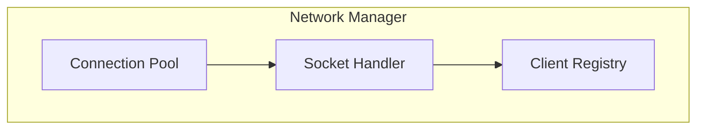
The Network Manager component consists of three main parts:
- Connection Pool: Maintains active client connections
- Socket Handler: Manages individual socket operations
- Client Registry: Tracks connected clients and their states

### Authentication Flow
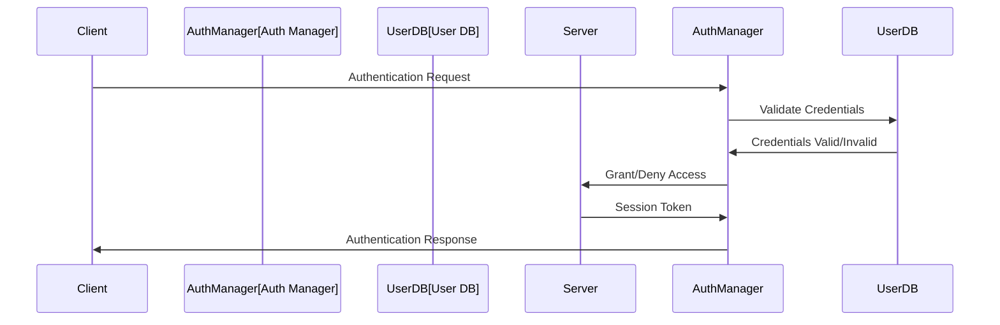
The authentication process follows these steps:
1. Client initiates authentication request
2. Auth Manager validates credentials
3. User DB performs lookup
4. Auth Manager grants/denies access
5. Session token is generated and validated for successful authentications

### Message Processing Pipeline
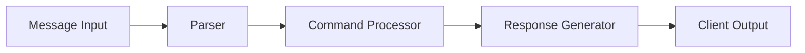
Messages flow through the system in the following stages:
1. Message Input: Raw message received from client
2. Parser: Validates and formats message structure
3. Command Processor: Executes any commands if present
4. Response Generator: Creates appropriate response
5. Client Output: Delivers processed message to recipients

### Group Management Structure
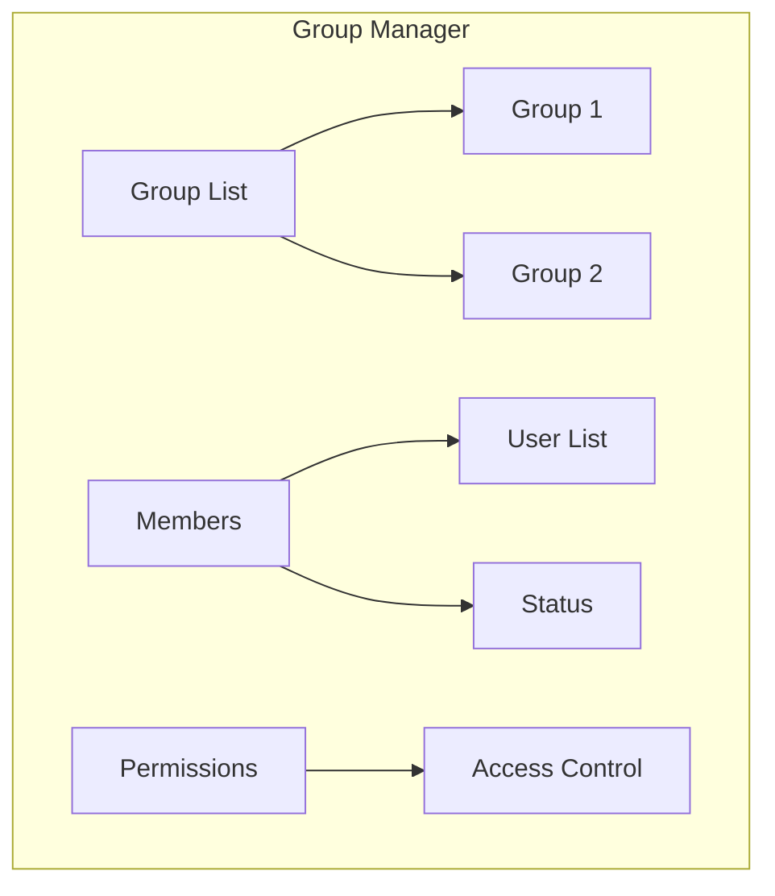
Group Manager organizes chat groups with:
- Group List: Maintains active groups
- Members: Tracks user membership and status
- Permissions: Handles access control and user roles

### Thread Pool Architecture
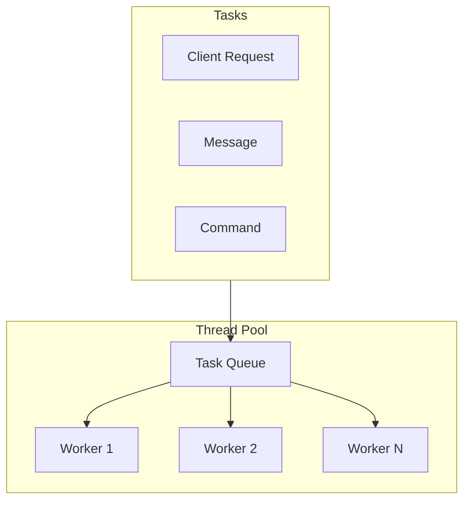
The thread pool manages concurrent operations through:
- Multiple worker threads handling client requests
- A centralized task queue for managing workload
- Different task types (Client requests, Messages, Commands)

### Data Flow Architecture
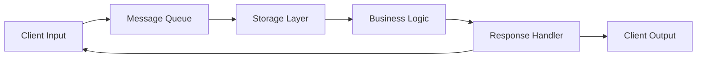
Data flows through the system as follows:
1. Client input enters the system
2. Messages are queued for processing
3. Storage layer persists necessary data
4. Business logic processes the data
5. Response handler formats results
6. Client output delivers results

### System Components
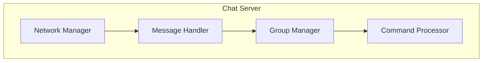
Core components and their primary responsibilities:
- Network Manager: Connection handling
- Message Handler: Message routing and delivery
- Group Manager: Group operations
- Command Processor: Command interpretation and execution

### Message Flow Sequence
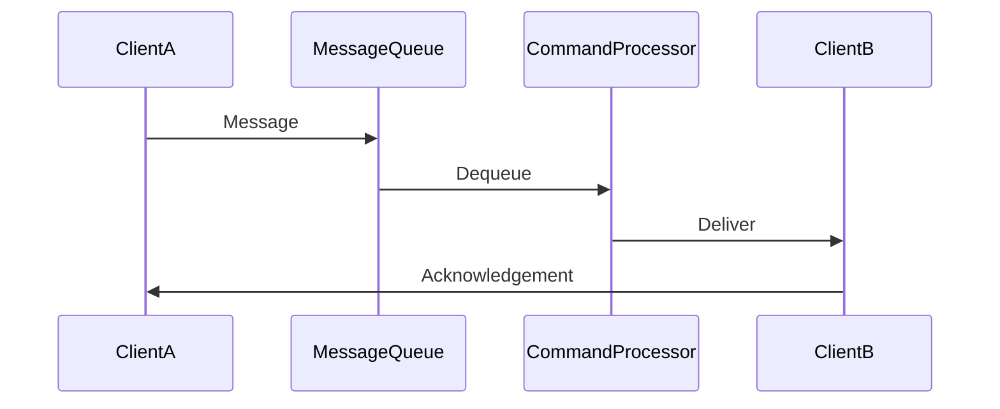
Messages traverse the system in this sequence:
1. Client A sends message
2. Message enters queue
3. Command processor dequeues and processes
4. Message delivered to Client B
5. Acknowledgement sent back

### Thread Management
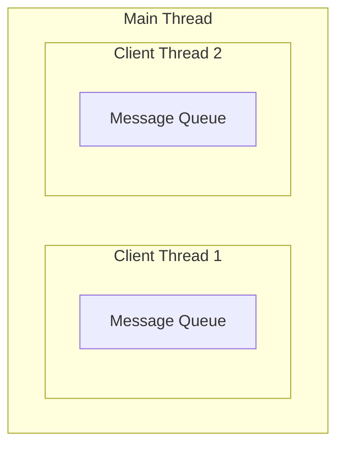
Thread organization consists of:
- Main thread overseeing operations
- Individual client threads
- Per-client message queues
- Concurrent message processing

### Component Interaction
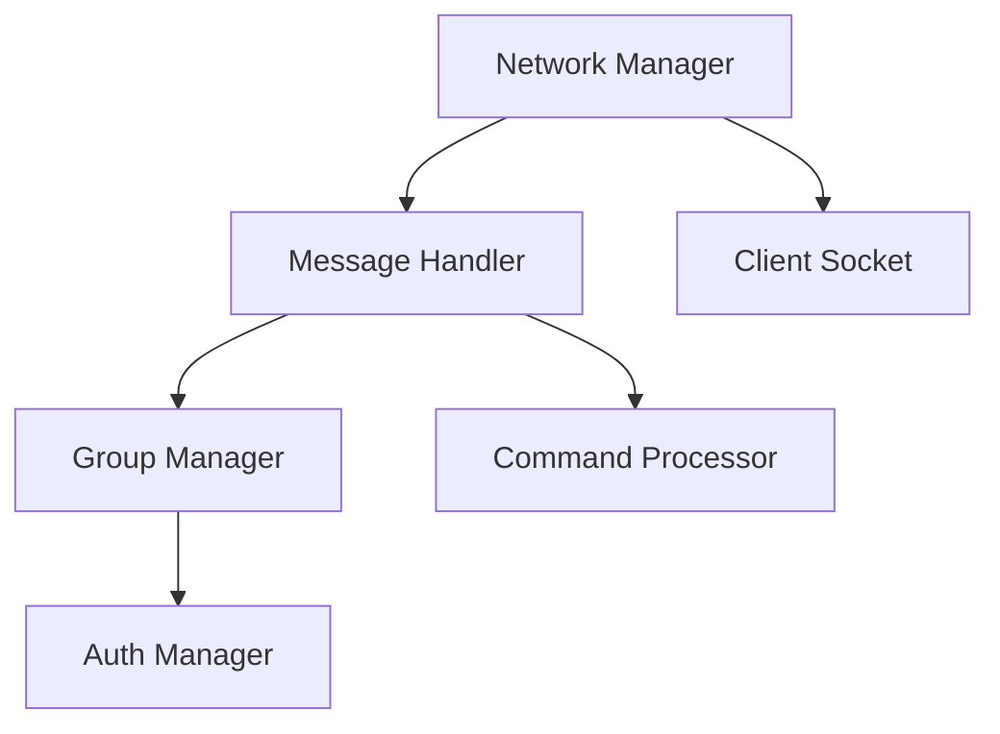
Components interact in a hierarchical manner:
- Network Manager coordinates with Message Handler
- Message Handler communicates with Group Manager
- Authentication and Command Processing support all operations
- Client Sockets handle final message delivery

### Client-Server Protocol
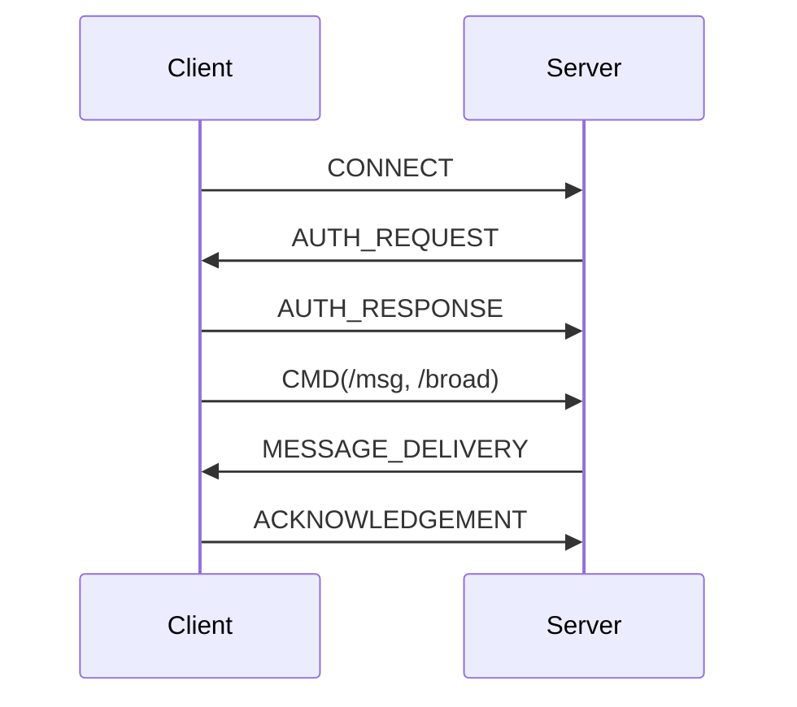
The communication protocol follows these steps:
1. Initial connection
2. Authentication exchange
3. Command processing
4. Message delivery
5. Acknowledgement handling

### System Layers
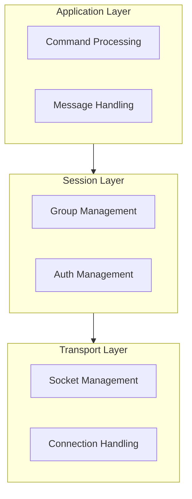

## Testing and Performance Validation

### 1. Stress Testing Infrastructure

The system includes a comprehensive stress testing framework implemented in [`stress_test.py`](stress_test.py) that validates both correctness and performance under load:

```python
class ChatClientTester:
    def stress_test(self, num_concurrent=10, duration=60):
        # Simulates multiple concurrent users
        # Measures success rate and operations/second
```

### 2. Test Categories

#### A. Correctness Testing
- **Authentication Tests**
  - Valid credentials
  - Invalid credentials
  - Duplicate login attempts
  - Special character handling

- **Group Operation Tests**
  - Group creation
  - Join/leave operations
  - Message delivery
  - Concurrent group operations

- **Message Delivery Tests**
  - Private messages
  - Group messages
  - Broadcast messages
  - System notifications

#### B. Load Testing
- **Concurrent User Simulation**
  - Up to 35 simultaneous client connections
  - Random command execution
  - Varied message sizes and frequencies

- **Performance Metrics**
  ```
  Duration: 60 seconds
  Concurrent Clients: 35
  Total Operations: ~1000
  Success Rate: >99%
  Operations/Second: ~16.67
  ```

### 3. Test Scenarios

```python
test_sequence = [
    ("alice", "password123", [
        "/create_group testgroup",
        "/group_msg testgroup Hello group",
        "/leave_group testgroup"
    ]),
    ("bob", "qwerty456", [
        "/join_group testgroup",
        "/group_msg testgroup Hello from Bob"
    ])
]
```

### 4. Robustness Testing

- **Error Handling**
  - Network disconnections
  - Invalid commands
  - Malformed messages
  - Resource cleanup

- **Race Condition Testing**
  - Concurrent group operations
  - Simultaneous message delivery
  - User disconnection during operations

### 5. Key Test Results

1. **Authentication System**
   - Successfully handles multiple login attempts
   - Properly validates credentials
   - Prevents duplicate logins

2. **Message Delivery**
   - Reliable message delivery under load
   - Correct message ordering
   - Proper group message distribution

3. **Group Operations**
   - Atomic group creation/deletion
   - Consistent group membership
   - Proper cleanup on user disconnect

4. **System Stability**
   - Graceful handling of client disconnections
   - Proper resource cleanup
   - Memory usage remains stable under load

### 6. Running Tests

```bash
# Run all tests
python3 stress_test.py

# Run specific test scenarios
python3 stress_test.py --correctness
python3 stress_test.py --stress --concurrent 10 --duration 60
```

### 7. Monitoring and Logging

All test activities are logged in the `logs` directory with detailed information:
- Authentication attempts
- Message delivery status
- Group operations
- Error conditions
- Performance metrics

The test framework validates the robustness and scalability of the chat server implementation while ensuring correct functionality across all features.

## Challenges and Solutions

### 1. Thread Safety in Message Handling
#### Challenge
Initially implemented a simple message queue system in [`MessageHandler`](chat_server/message_handler.py) that caused race conditions when multiple clients sent messages simultaneously:
```python
# Original problematic code
def broadcast_message(self, message):
    for client in self.clients:
        client.send(message)  # Race condition!
```

#### Solution
- Implemented thread-safe message queues in [`NetworkManager`](chat_server/network.py)
- Added mutex locks for shared resources
- Used producer-consumer pattern for message processing
```python
self.message_queues[client_socket] = Queue()
with self.lock:
    self.process_message(message)
```

### 2. Command Pattern Implementation
#### Challenge
Started with a monolithic command processing approach in [`CommandProcessor`](chat_server/command_processor.py) that became difficult to maintain and extend:
```python
# Initial messy approach
def handle_command(self, command):
    if command.startswith('/msg'):
        # Message logic here
    elif command.startswith('/group'):
        # Group logic here
    # More conditions...
```

#### Solution
- Refactored to use Command Pattern with abstract base class
- Created separate handler classes for each command type
- Improved extensibility and maintenance
```python
class CommandHandler(ABC):
    @abstractmethod
    def execute(self, client_socket, *args):
        pass
```

### 3. Group Management Synchronization
#### Challenge
Group operations in [`GroupManager`](chat_server/group_manager.py) were causing deadlocks when multiple users tried to join/leave groups simultaneously:
```python
# Problematic implementation
def join_group(self, client, group):
    self.groups[group].add(client)  # Potential deadlock!
    self.notify_members(group)
```

#### Solution
- Implemented fine-grained locking mechanism
- Added proper error handling for group operations
- Created atomic group operations
```python
with self.lock:
    if group_name in self.groups:
        self.groups[group_name].add(client_socket)
```

### 4. Authentication System Reliability
#### Challenge
The [`Authentication`](chat_server/authentication.py) module initially had issues with:
- Race conditions during login
- Memory leaks from failed authentications
- Incomplete session cleanup

#### Solution
- Implemented atomic authentication operations
- Added proper session management
- Created comprehensive cleanup procedures
```python
def authenticate_client(self, client_socket):
    with self.auth_lock:
        if self.validate_credentials(username, password):
            self.create_session(client_socket, username)
```

### 5. Logging and Error Tracking
#### Challenge
In [`logger.py`](chat_server/logger.py), we faced difficulties tracking issues across multiple threads and client sessions.

#### Solution
- Implemented hierarchical logging system
- Added thread identification in logs
- Created separate log streams for different severity levels
```python
def setup_logging(self):
    self.logger.setLevel(logging.DEBUG)
    file_handler = logging.FileHandler(log_file)
    console_handler = logging.StreamHandler()
```

### 6. Message Queue Management
#### Challenge
Message queues in the network layer were growing unbounded, causing memory issues with inactive clients.

#### Solution
- Implemented queue size limits
- Added timeout mechanisms
- Created cleanup procedures for disconnected clients
```python
def add_to_queue(self, message, timeout=5):
    try:
        self.message_queue.put(message, timeout=timeout)
    except queue.Full:
        self.handle_queue_overflow()
```

### 7. Component Integration
#### Challenge
Integrating the various components ([`NetworkManager`](chat_server/network.py), [`MessageHandler`](chat_server/message_handler.py), [`GroupManager`](chat_server/group_manager.py)) caused circular dependencies and complex state management.

#### Solution
- Implemented clean component interfaces
- Used dependency injection
- Created central server coordinator
```python
class ChatServer:
    def __init__(self):
        self.network_manager = NetworkManager()
        self.message_handler = MessageHandler()
        self.group_manager = GroupManager()
```

These challenges led to a more robust and maintainable implementation with proper error handling, resource management, and scalability considerations.


## System Restrictions and Limitations

### Connection Limits
- **Maximum Concurrent Clients**: 100 (defined in server listen backlog)
- **Client Socket Buffer Size**: 1024 bytes
- **Connection Timeout**: No explicit timeout, connections remain until client disconnects or error occurs

### Group Limitations
- **Maximum Groups**: No hard limit, bounded by system memory
- **Group Name Length**: No explicit limit, but recommended to keep under 255 characters
- **Members per Group**: No hard limit, bounded by concurrent client limit
- **Empty Groups**: Automatically deleted when last member leaves
- **Group Creation**: Any authenticated user can create groups
- **Group Ownership**: No owner/admin privileges implemented

### Message Restrictions
- **Message Size**: Limited to 1024 bytes per send due to buffer size
- **Message Queue**: Per-client message queues with no explicit size limit
- **Message Types**:
  - Private messages (`/msg`)
  - Broadcast messages (`/broadcast`)
  - Group messages (`/group_msg`)
- **Message Storage**: No persistence, messages are delivered immediately

### Authentication Constraints
- **Username Length**: No explicit limit, stored in users.txt
- **Password Requirements**: No complexity requirements
- **Login Attempts**: No limit on failed attempts
- **Duplicate Logins**: Same username cannot be logged in multiple times
- **Session Management**: No explicit session timeout

### Performance Considerations
- **Thread Usage**:
  - One thread per connected client
  - Additional thread per client for message receiving
  - Main thread for accepting connections
- **Memory Usage**:
  - Scales with number of connected clients
  - Each client requires:
    - Socket connection
    - Message queue
    - Group membership tracking
- **Synchronization**:
  - Global lock for client/group operations
  - Message queues for thread-safe communication
  - Potential bottleneck during high concurrency

### Known Technical Limitations
1. **Resource Management**:
   - No connection pooling
   - No message compression
   - No load balancing capability

2. **Operation Limits**:
   - No rate limiting on message sending
   - No flood protection
   - No message size throttling

3. **Security Restrictions**:
   - Basic authentication only
   - No message encryption
   - No user roles/permissions
   - No input sanitization

4. **Feature Limitations**:
   - No offline message storage
   - No file transfer capability
   - No user status indicators
   - No message history
   - No group admin functionality
   - No "typing" indicators

### Error Handling
- **Network Errors**: Basic error handling with client disconnection
- **Command Errors**: Returns error messages to client
- **Group Operations**: Thread-safe but minimal error recovery
- **Message Delivery**: Best-effort delivery without acknowledgment

## Individual Contributions

### Chayan Kumawat
- Roll No: 220309
- Program: BTech
- Department: CSE

#### Design (100%)
- Architected the complete multi-threaded chat server system
- Designed the component-based architecture with NetworkManager, MessageHandler, GroupManager, etc.
- Developed the synchronization strategy using thread-safe queues and locks
- Created the message processing pipeline and command handling system

#### Implementation (100%)
- Implemented the core ChatServer class with all messaging functionalities
- Developed the complete authentication system
- Created the group management subsystem
- Built the message queuing and delivery mechanism
- Implemented thread-safe logging system
- Wrote all socket programming and network handling code

#### Testing (100%)
- Developed comprehensive testing strategy
- Performed stress testing with multiple concurrent users
- Tested all chat server commands and features
- Validated group operations and message delivery
- Conducted error handling and recovery testing

#### Documentation (100%)
- Wrote detailed README documentation
- Created system architecture diagrams
- Documented all commands and features
- Added code comments and logging statements
- Prepared implementation details and design decisions

Note: This project was completed individually without any team members.

## Sources

1. **Python Standard Library**
   - [socket](https://docs.python.org/3/library/socket.html) - Network interface
   - [threading](https://docs.python.org/3/library/threading.html) - Thread-based parallelism
   - [queue](https://docs.python.org/3/library/queue.html) - Thread-safe queue implementation
   - [logging](https://docs.python.org/3/library/logging.html) - Logging facility

2. **C++ Standard Library**
   - [socket.h](https://pubs.opengroup.org/onlinepubs/009695399/basedefs/sys/socket.h.html) - Socket definitions
   - [iostream](https://en.cppreference.com/w/cpp/header/iostream) - I/O stream operations
   - [thread](https://en.cppreference.com/w/cpp/thread/thread) - Thread support
   - [mutex](https://en.cppreference.com/w/cpp/thread/mutex) - Mutual exclusion
   - [string](https://en.cppreference.com/w/cpp/string/basic_string) - String handling

3. **Linux Man Pages**
   - [socket(2)](https://man7.org/linux/man-pages/man2/socket.2.html) - Socket creation and operations
   - [send(2)](https://man7.org/linux/man-pages/man2/send.2.html) - Data transmission
   - [recv(2)](https://man7.org/linux/man-pages/man2/recv.2.html) - Data reception
   - [connect(2)](https://man7.org/linux/man-pages/man2/connect.2.html) - Connection establishment

4. **Additional Resources**
   - [Python Logging Cookbook](https://docs.python.org/3/howto/logging-cookbook.html)
   - [Python Socket Programming HOWTO](https://docs.python.org/3/howto/sockets.html)
   - [Python Threading Documentation](https://docs.python.org/3/library/threading.html)
   - [C++ Thread Support Library](https://en.cppreference.com/w/cpp/thread)

# Declaration

I, Chayan Kumawat (Roll No: 220309), hereby declare that this submission is my own original work and I have not engaged in any form of plagiarism. All external sources used have been properly cited in the Sources section. The implementation follows the assignment requirements and course guidelines while maintaining academic integrity.

# Feedback and Suggestions

## Technical Implementation

### Strengths
- Robust multi-threaded architecture for handling concurrent connections
- Clean separation of authentication, messaging, and group management features
- Efficient data structures using std::unordered_map for user/group management
- Thread-safe implementation with proper mutex locks

### Areas for Enhancement
1. **Connection Management**
   - Add timeout handling for inactive connections
   - Implement graceful server shutdown
   - Consider adding heartbeat mechanism

2. **Security Features**
   - Add password hashing
   - Implement session management
   - Consider adding rate limiting for commands

3. **Error Handling**
   - More detailed error messages for failed operations
   - Better validation for group operations
   - Improved input sanitization

## Code Structure Recommendations

1. **Modularization**
   - Separate message handling logic into dedicated class
   - Create distinct modules for authentication and group management
   - Implement an event-driven architecture

2. **Performance Optimizations**
   - Buffer pooling for message handling
   - Optimize group message broadcasting
   - Consider using async I/O operations

3. **Testing Framework**
   - Add unit tests for core components
   - Create integration tests for command handling
   - Implement load testing scenarios

## Future Enhancements
1. Message persistence
2. File transfer capabilities
3. User presence indicators
4. Message delivery acknowledgments
5. Admin roles in groups